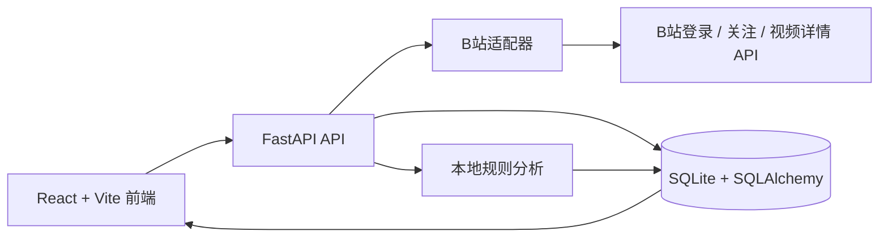

# 框架结构与数据流

## 分层结构



## 前端

- `frontend/src/App.tsx`：页面状态、数据请求、博主卡片、详情抽屉、主题弹窗、趋势柱状图。
- `frontend/src/styles.css`：暗调轻科技设计系统、3D 阴影、圆角控件、响应式布局、动效和滚动条处理。
- `frontend/src/main.tsx`：React 挂载入口。

页面包括洞察总览、数据接入、运行环境和分析设置四个工作区。

## 后端

- `backend/main.py` 创建 FastAPI、注册路由，并在存在 `frontend/dist` 时托管生产前端。
- `backend/models.py` 定义 Creator、Content、SyncTask、AnalysisSetting 等表。
- `backend/database.py` 创建 SQLite 引擎并执行轻量字段迁移。
- `backend/api/bilibili.py` 管理扫码登录、关注列表读取、视频读取、互动字段补齐和同步任务。
- `backend/analysis.py` 对视频标题/简介提取关键词，计算分类和指标。

## B站同步数据流

```text
login/qr
  → login/status
  → sync/start
  → /x/relation/followings
  → /x/space/arc/search
  → /x/web-interface/view
  → Creator / Content
  → analyze_all()
  → dashboard APIs
```

`/x/web-interface/view` 的 `data.stat` 是互动数据的正式来源，其中包含 `view`、`like`、`reply` 和 `share`。

## 数据模型关系

```text
Creator 1 ───── N Content
Creator 1 ───── N SyncTask（通过平台同步历史关联）
AnalysisSetting 负责全局时间窗口、采样数、延迟和权重
```

## 安全边界

- B站 Cookie 只保存在本地 `data/bilibili_session.json`。
- 数据库和导入文件只保存在 `data/`。
- API 默认仅监听 `127.0.0.1`。
- 微信适配器当前只负责检测和启动本地客户端，不读取聊天记录、联系人或私密内容。
